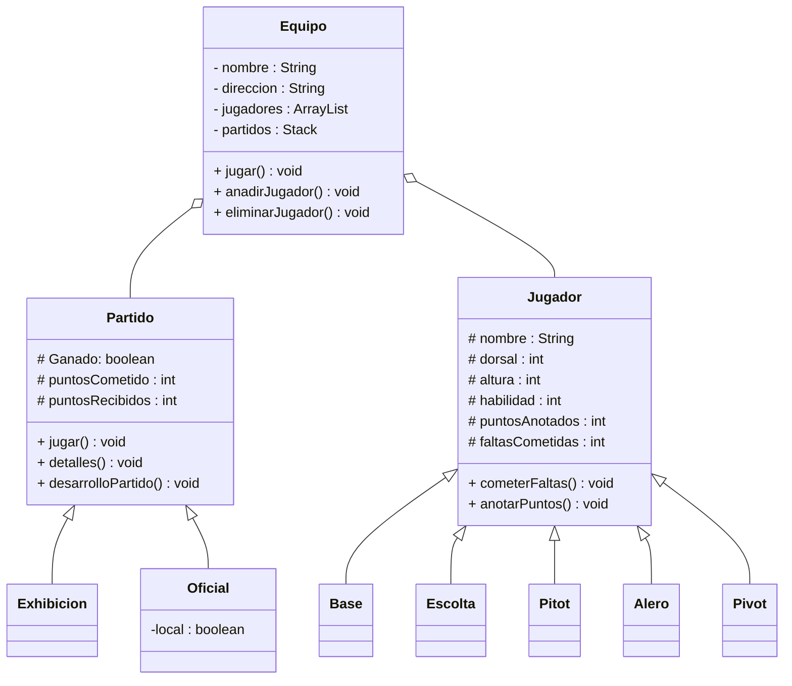

```mermaid
classDiagram
    class Equipo {
        - nombre : String
        - direccion : String
        - jugadores : ArrayList<Jugador>
        - partidos : Stack<Partido>

        + jugar() void
        + anadirJugador()  void
        + eliminarJugador() void
        
    }
    class Partido {
        # Ganado: boolean
        # puntosCometido : int
        # puntosRecibidos : int

        + jugar() void
        + detalles() void
        + desarrolloPartido() void
    }

    class Exhibicion{

    }

    class Oficial{
        -local : boolean
    }

    class Jugador{
        # nombre : String
        # dorsal : int
        # altura : int
        # habilidad : int
        # puntosAnotados : int
        # faltasCometidas : int

        + cometerFaltas() void
        + anotarPuntos() void
    }

    class Base{

    }

    class Escolta{

    }

    class Alero{

    }

    class Pitot{

    }

    class Pivot{

    }


    Partido <|-- Exhibicion
    Partido <|-- Oficial
    Jugador <|-- Base
    Jugador <|-- Escolta
    Jugador <|-- Pitot
    Jugador <|-- Alero
    Jugador <|-- Pivot

    Equipo o-- Partido
    Equipo o-- Jugador


```